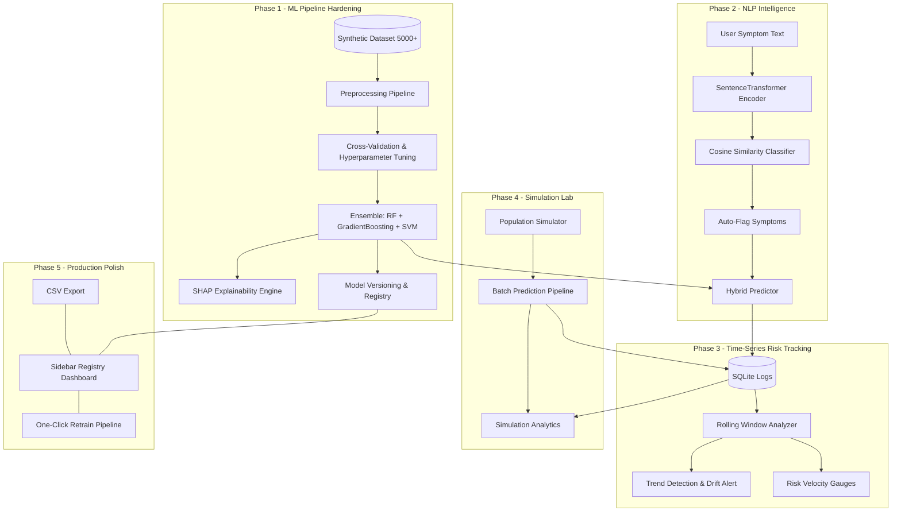

# Strategic Evolution Plan — Real-World Heatstroke AI & Data Science Platform

This document outlines the roadmap to evolve the **Clinical Heatstroke AI Predictor** from a basic diagnostic form into a production-grade Clinical AI & Simulation platform.

---

## Evolution Roadmap (5 Phases)

---

## Phase 1: ML Pipeline Hardening
*Objective: Upgrade model quality, train multiple algorithms, validate properly, and establish robust feature evaluation.*

### Proposed Changes:
1. **Expand Dataset (`model_trainer.py`):** Increase data size from 1,000 to 5,000 samples with more clinical nuance. Add features like `MuscleCramps`, `Nausea`, `Confusion`.
2. **Multi-Model Pipeline:** Train three different classifier models: `RandomForestClassifier`, `GradientBoostingClassifier`, and `SVC` (Support Vector Classifier).
3. **Cross-Validation & Tuning:** Implement Stratified K-Fold cross-validation (5-fold) and perform hyperparameter optimization via `GridSearchCV`.
4. **Metrics Registry:** Save model artifacts containing accuracy, precision, recall, F1-score, and a confusion matrix array for the frontend charts.

---

## Phase 2: NLP Symptom Intelligence
*Objective: Parse natural language clinical complaints offline to auto-extract structured physiological symptoms.*

### Proposed Changes:
1. **Sentence Transformers Integration (`symptom_analyzer.py`):** Integrate the lightweight `all-MiniLM-L6-v2` transformer model (approx 80MB) for offline semantic similarity computation.
2. **Symptom Embeddings:** Map clinical symptoms (dizziness, headache, nausea, confusion, muscle cramps) to anchor dictionaries.
3. **App Integration (`app.py`):** Provide a "📝 Describe Symptoms" text box. Similarity extraction runs on keypress or click, checking checkboxes automatically and injecting flags into the ML input features.

---

## Phase 3: Time-Series Risk Tracking
*Objective: Track risk over time to capture clinical deterioration trends instead of standalone calculations.*

### Proposed Changes:
1. **History Tracking (`risk_tracker.py`):** Query database history for specific patient identifiers.
2. **Trend Detection:** Compute moving average lines of patient body temperature, heart rate, and prediction scores.
3. **Alert Triggers:** Fire a UI notification ("🚨 Worsening Trend detected") if risk scores escalate consecutively across 3+ runs.

---

## Phase 4: Population Simulation Lab
*Objective: Provide a batch cohort simulator representing heat stress scenarios (e.g. outdoor worker cohorts during a Delhi heatwave vs normal Mumbai humidity).*

### Proposed Changes:
1. **Scenario Engine (`simulator.py`):** Define standard patient demographic profiles for different climates:
   - *Heatwave Delhi:* High temperature, low humidity, low hydration.
   - *Monsoon Mumbai:* High humidity, moderate temp, low hydration.
   - *Normal Bangalore:* Moderate temp, moderate humidity.
2. **Batch Generation:** Generate simulated patient batches (10 to 500 records), run parallel predictions, write logs to the SQLite DB under a `simulation_batch_id`.
3. **Simulation Dashboard (`app.py`):** Dedicated tab showing simulation distribution, average vitals box plots, and population risk summaries.

---

## Phase 5: Production Polish
*Objective: Professional-grade packaging, analytics completeness, and one-click retraining.*

### Proposed Changes:
1. **One-Click Retrain UI:** Trigger model retraining from the UI, displaying a before/after accuracy metric chart.
2. **Data Export:** Export logs directly as downloadable CSVs in Streamlit.
3. **Clean Code & Duplicates Removal:** Cleanup duplicate functions in UI helpers and app tabs (e.g. duplicate medical portal containers in `app.py`).
